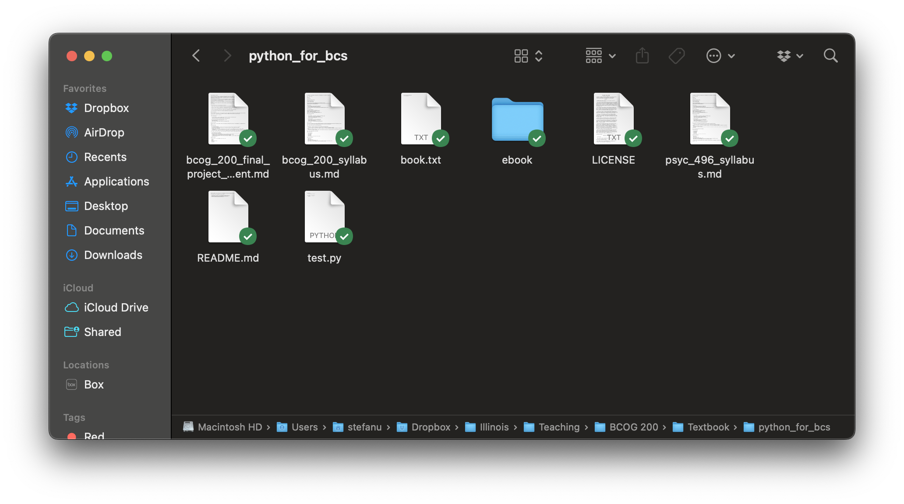
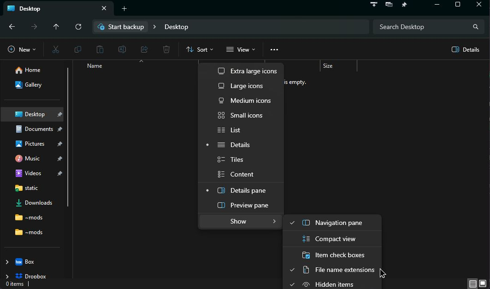
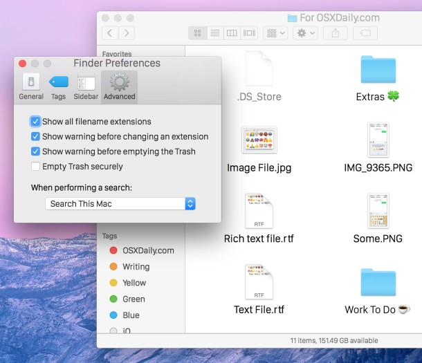

# 0.1 A Gentle Introduction to Your Computer

Before we dive into programming with Python, it's essential to understand how your computer is
organized and how to navigate it effectively. This knowledge forms the foundation for everything
we'll do in this course. Even if you think you already know how to navigate your computer, I would
encourage you to finish reading this chapter, as you may be surprised to learn a thing or two.

## The Basics of Computer Organization

Your computer stores information in a hierarchical system of files and folders (also called directories). Understanding
this organization is crucial for programming, as you'll need to navigate between different locations to create, modify,
and run your code. 

### Files and Folders

- **Files** are individual documents that contain data. They can be text documents, images, programs, or any other type
  of data. Files almost always have a name followed by an extension (like `.txt`, `.py`, or `.jpg`). This extension
  tells your computer what type of file it is, which determines how it should be opened and what program should be used
  to work with it.
  - By default, your operating system may hide the file extensions, so you may need to change yoursettings to expose
    them — more on this below.
- **Folders** (aka directories) are containers that can hold files and other folders, helping you organize related files
  together. Folders do not have extensions.

## File System Hierarchy

Your computer's file system is organized hierarchically, starting from a **root** directory and branching out from
there.

- On **Windows**, the root is typically represented by drive letters like `C:\`
- On **Mac/Linux**, the root is represented by a forward slash `/`

From the root, your file system contains several standard folders:

- **Windows**: `C:\Users\YourUsername\` contains your personal files
- **Mac**: `/Users/YourUsername/` contains your personal files
- **Linux**: `/home/YourUsername/` contains your personal files

### About placeholders

Throughout this course, we will make extensive use of **placeholders**. For example,when you see `YourUsername`
in a path — or similarly vague terms like `project_name`, `my_variable`, and so on — you should replace it with the
information that is relevant to your situation. For example, if your username is "alex", the Windows path would be
`C:\Users\alex\`. Use your discretion, as these are templates for you to adapt to your specific situation.

Your personal directory (often called your "home" directory) contains folders like Documents, Downloads, Desktop, etc.

## File Paths

A file path is like an address that tells your computer exactly where to find a file or folder. There are two types of
paths:

1. **Absolute paths** start from the root directory:

   - Windows: `C:\Users\YourUsername\Documents\project\code.py`
   - Mac/Linux: `/Users/YourUsername/Documents/project/code.py`

2. **Relative paths** start from your current location (as in, where you currently are in the file system; if this is
   confusing, this will make more sense when we talk about the **terminal**).
   - For example, if you're already in your Documents folder, the relative path to the same file would simply be
     `project/code.py`
   - And if you're at your home directory, the relative path to the same file would be `Documents/project/code.py`

> [!NOTE] Forward vs. Back slashes
> Notice that Windows uses backslashes (`\`) while Mac and Linux use forward slashes (`/`) in their file paths.
> When writing code, you'll often use forward slashes, even on Windows, as most programming languages interpret them
> correctly.

It is generally good practice to use **relative paths** when writing code, as this makes your code more portable. Use
absolute paths only when absolutely necessary.

## File Extensions and Types

File extensions are suffixes at the end of a filename that indicate the file type, and therefore the type of data that
the file contains. This also determines the program that should be used to open it. Here are some common file extensions:

- `.txt` — (Plain) text file
- `.csv` — Comma-separated values file (often used for data). 
  - CSVs are a form of tabular data, and are often opened in spreadsheet software like Excel or Google Sheets for viewing and editing — at least, for most typical use cases.
- `.json` — JavaScript Object Notation file (often used for data)
- `.py` — Python script
- `.html` — Web page. Can be opened in a web browser.
- `.jpg`, `.png` — Image files
- `.docx` or `.doc` — Microsoft Word document
- `.pdf` — PDF document
- `.exe` — Executable file (Windows). Opened directly by the Windows operating system to run the
  program it contains.
- And many, many, many more...

While programming in this course, you'll primarily be working with `.py` files (Python scripts); `.txt`, `.csv`, and
`.json` files (for data); and `.md` files (for documentation). With very few exceptions, **every file should have an
extension.** If you have created a file without an extension, you can add one by right-clicking the file and selecting
"Rename", then type out the extension you need (e.g., `.py`).

## Using Your Computer's Interface

While we'll be using the terminal extensively in this course, it's good to understand both ways of interacting with your computer:

1. **Graphical User Interface (GUI)**: The visual way to interact with your computer using windows, icons, and a mouse.
2. **Command Line Interface (CLI)**: Text-based interaction via the terminal, which we'll cover in the next section.

The GUI is more intuitive for beginners, but the CLI offers more power and flexibility — essential skills for
programming.

> [!TIP] 
> #### Parallel instructions for Mac and Windows
> Where appropriate, I will provide parallel instructions for Mac and
> Windows. If you are on a Mac, you can ignore the Windows-specific instructions, and vice versa.
> **Do not try to do both sets of instructions at once on the same computer.**

### Navigating the File System Graphically

The most common way to navigate the file system is to use your operating system's dedicated Graphical User Interface (GUI) tool. On Windows, you would use File Explorer; on Mac, Finder. Below are some screenshots of how this looks on the two operating systems. You can double click on a folder to open it (i.e., explore its contents). The same goes for files, which will open with the default program associated with that file type.



XXX TODO: Add screenshot of Windows File Explorer

### Showing File Extensions

By default, your operating system likely hides file extensions. It's important to make them visible for programming.

**On Windows:**

1. Open File Explorer
2. Click on the "View" tab
3. Check the box for "File name extensions"
4. While you're at it, also check "Hidden items"



**On Mac:**

1. Open Finder
2. Click "Finder" in the menu bar, then "Settings" (or "Preferences" in older versions)
3. Go to the "Advanced" tab
4. Check "Show all filename extensions"
5. To show hidden files at any time, press <kbd>Cmd</kbd> + <kbd>Shift</kbd> + <kbd>.</kbd>

> [!NOTE] On keyboard shortcuts
> We've encountered our first keyboard shortcut! When you see a shortcut like
> <kbd>Cmd</kbd> + <kbd>Shift</kbd> + <kbd>.</kbd>, it means you can press all three of these keys at the same time to
> achieve some result. (Of course, I'm not asking you to press the <kbd>+</kbd> key — we are using "+" to mean "and" in
> this instance.) This approach is often faster than clicking through your computer's GUI, and we will use many more
> shortcuts throughout this course.



## Project Organization

Good organization of your programming projects will save you time and frustration. Here's a basic structure to follow:

```
project_name/
│
├── main.py           # Main script to run your program
├── data/             # Folder for any data files
│   └── input.txt     # An example data file
│
├── modules/          # Folder for your Python modules
│   └── helper.py     # A helper module
│
└── README.md         # Documentation explaining your project
```

For this course, you'll want to create a dedicated folder for all your work. We recommend creating a
folder with a name like `bcog200` on your Desktop or in your Documents folder. This will make it
easier to find your work later. Within that folder, you will probably want to have separate
subfolders for the different types of work you will do in this course. For example, `Labs`,
`Homeworks`, and `Project`.

> [!TIP] Organizing your work more broadly 
> You can use this kind of structure as inspiration for
> organizing your digital life in general. For example, you might have a folder called `Illinois`
> that contains subfolders for each of your classes (e.g., `bcog100`, `bcog200`, `psyc230`), and
> then each of those classes would have subfolders for each unit of the course (which itself might
> have subfolders, and so on). 

## Exercise: Getting Set Up

Let's make sure you understand the key concepts covered so far. Try answering these questions:

1. **Path Analysis**: Consider the path `C:\Users\student\Documents\bcog200\Labs\lab1.py`

   - What is the absolute path to this file?
   - If your current location is the `Labs` folder, what would be the relative path to this file?
   - If your current location is the `Documents` folder, what would be the relative path to this file?

2. **File Extensions**: For each of the following files, identify what type of file it is and what program might be used to open it:

   - `lecture_notes.txt`
   - `analysis.py`
   - `profile_picture.jpg`
   - `data.csv`

3. **Understanding Placeholders**: In the path `/Users/YourUsername/Documents/project_folder/`, identify all the placeholders that would need to be replaced with actual values on your computer.

4. **Setting things up**: Before moving on, make sure to complete the following steps:

   - Create a folder somewhere on your computer (e.g., in your `Documents` folder or on your Desktop) called `bcog200`
   - Inside this folder, create a new folder called `Labs`, another new folder called `Homeworks`, and another new folder called `Project`
   - Inside of your `Labs` folder, create a new file called `lab1.py`
   - Set your computer to show file extensions (and hidden items, if at all possible)

> [!TIP]
> Take a moment to actually complete this exercise. Understanding these concepts now will save you a lot of time and frustration later!

Next: [0.2. Terminal Crash Course](0.2.%20Terminal%20Crash%20Course.md)
Previous: [0.0. How to Succeed In This Course](0.0.%20How%20to%20Succeed.md)
