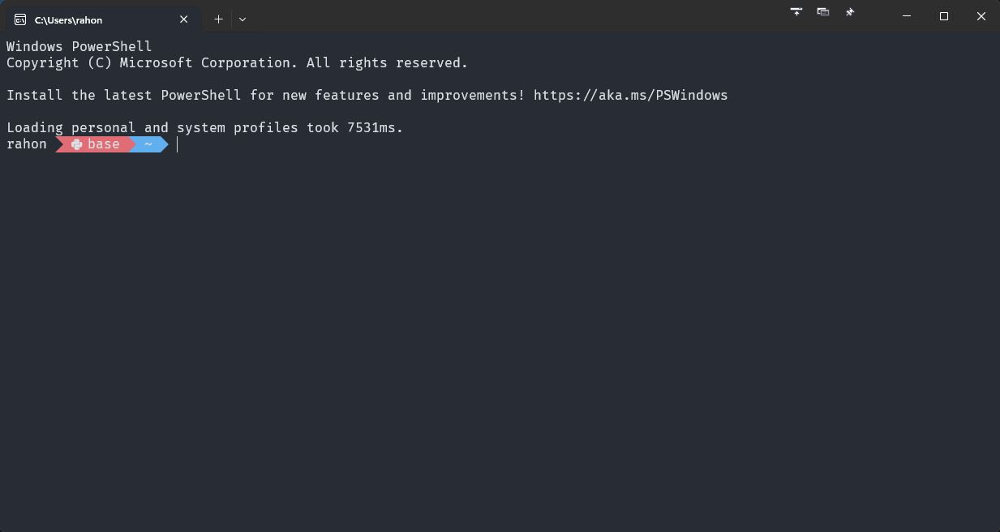
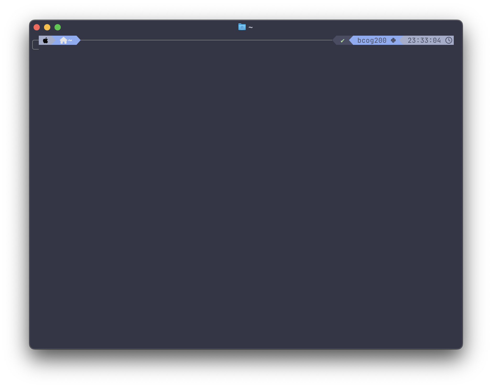

# 0.2. The Terminal: Your Command Center

Earlier, we introduced the concept of files, folders, and navigating through your computer's file
system using the graphical user interface (GUI). Now, we'll explore a more powerful way to interact
with your computer: the terminal.

## What is the Terminal?

The terminal (also called the command line or command prompt) is a **text-based interface** that
allows you to control your computer by typing *commands* instead of using a mouse. While it might
look intimidating at first, the terminal offers several advantages:

- **Speed**: Many tasks can be completed much faster using the terminal
- **Power**: Some actions are only possible via the terminal
- **Automation**: You can create scripts to automate repetitive tasks using the terminal
- **Remote access**: You can control computers that don't even have a graphical user interface to
  begin with

Different operating systems have different default terminal applications:

- **Windows**: Command Prompt or PowerShell (_please do not use Command Prompt_ for this course; we
  will use PowerShell)
- **Mac/Linux**: Terminal

Whenever I say "terminal" in this course, mentally substitute it with the terminal application for
your operating system.

## Opening the Terminal

Let's start by opening the terminal on your computer.

**On Windows:**

1. Press <kbd>Win</kbd> + <kbd>R</kbd> to open the Run dialog
2. Type `powershell` and press Enter, or
3. Search for "PowerShell" in the Start menu (i.e., press the <kbd>Win</kbd> key and type "powershell")
4. Again, **please do not use Command Prompt** for this course — it is verboten



**On Mac:**

1. Press <kbd>Cmd</kbd> + <kbd>Space</kbd> to open Spotlight Search
2. Type "Terminal" and press Enter, or
3. Find Terminal in Applications → Utilities



My terminals look a little different from the default, but the basics are the same. When you first open the terminal,
you'll see a prompt that looks something like this:

- Windows PowerShell: `PS C:\Users\YourUsername>`
- Mac/Linux: `YourUsername@ComputerName:~$`

This prompt indicates that the terminal is ready to accept commands. The text before the `>` or `$` symbol shows your
current location in the file system.

> [!TIP] Optional: Alternative terminals 
> You may have noticed that the screenshot(s) of my terminal(s) look different from yours. This is
> because I am using different terminal applications with custom settings that take a little time
> and energy to set up. If you are interested in diving deep into terminal customization, I
> recommend using Windows Terminal, Tabby or WezTerm on Windows, and [Ghostty](https://ghostty.org/)
> on Mac. For theming, I'd recommend [Oh My Posh](https://ohmyposh.dev/) for any system, or 
> [Oh My Zsh](https://ohmyz.sh/) on Mac. 
> This [Windows Terminal setup guide](https://medium.com/@sotpotatis/the-ultimate-guide-to-getting-a-pretty-windows-terminal-11a400fd91a9)
> still works well as of 2025.
> 

## Understanding Commands

In the terminal, you enter commands to tell your computer what you want to do. This means typing something, then
pressing <kbd>Enter</kbd> to run a command. Commands generally follow this pattern:

```
command [options] [arguments]
```

- **command**: The action you want to perform
- **options**: Flags that modify how the command works (usually start with `-` or `--`)
- **arguments**: What you want the command to act on (like file names or paths)

For example, in the command `ls -l Documents`, `ls` is the command, `-l` is an option (to show detailed listing), and
`Documents` is the argument (the folder to list). Notice that these are separated by **spaces**. `ls-lDocuments` simply
will not work; it is not a valid command. When I verbally describe a command, I am not going to say "space" every time.
Instead, I will exaggerate the pause between the command, options, and arguments. For example, I would say "elle ess"
(long pause) "dash elle" (long pause) "documents" to refer to the command `ls -l Documents`.

## Basic Navigation

Remember the file paths we discussed in the previous section? The terminal allows you to navigate through these paths using commands. Here are the essential navigation commands:

| Command             | Description                                                      | Windows Equivalent                                         |
| ------------------- | ---------------------------------------------------------------- | ---------------------------------------------------------- |
| `pwd`               | **P**rint **W**orking **D**irectory: shows your current location | `pwd` (PowerShell)                                         |
| `ls`                | **L**i**s**t files and folders in the current directory          | `dir` (or `ls` in PowerShell)                              |
| `cd directory_name` | **C**hange **D**irectory: move to the specified directory        | Same                                                       |
| `cd ..`             | Move up one level to the parent directory                        | Same                                                       |
| `cd ~`              | Move to your home directory                                      | `cd ~` (PowerShell) or `cd %USERPROFILE%` (Command Prompt) |

### Exercise: Practice Navigation

Let's practice moving around your computer. Imagine you want to navigate to your `bcog200` folder that you created in
the previous exercise:

0. Open your terminal if you haven't already.

1. First, check your current location

   ```
   pwd
   ```

2. Navigate to your home directory (if you aren't already there)

   ```
   cd ~
   ```

3. If you created the folder on your Desktop, navigate there:

   ```
   cd Desktop
   ```

4. Then navigate to your course folder:
   ```
   cd bcog200
   ```

You can also navigate directly using a single command with the full path:

```
cd ~/Desktop/bcog200
```

Remember that on Windows, paths use backslashes (`\`), but PowerShell now also accepts forward slashes (`/`), making it
more consistent with Mac/Linux.

## Listing Files and Folders

To see what's in your current directory, use the `ls` command (or `dir` in Windows Command Prompt):

```
ls
```

This shows a basic list of files and folders. You can add options to see more details:

```
ls -l  # Detailed list with file sizes, dates, permissions
ls -a  # Shows hidden files (those starting with a dot)
ls -la # Combines both options
```

## Creating Files and Folders

Here are some useful commands for creating files and folders:

| Command                  | Description                                   |
| ------------------------ | --------------------------------------------- |
| `mkdir name`             | Create a new directory/folder                 |
| `touch filename.txt`     | Create an empty text file (Mac/Linux)         |
| `echo "" > filename.txt` | Create an empty text file (Windows/Mac/Linux) |

Let's create a helpful structure for our class and make the first file where we will write our code for Lab 1:

```
# Make sure you're in your bcog200 folder
# I'm assuming that you created the bcog200 folder on your Desktop
cd ~/Desktop/bcog200

# Make separate folders for the Labs and Homeworks
mkdir Labs
mkdir Homeworks

# Create your first lab file
cd Labs
touch lab1.py  # On Mac/Linux
echo "" > lab1.py  # On Windows
```

## Viewing and Manipulating Files

| Command                 | Description                                                 |
| ----------------------- | ----------------------------------------------------------- |
| `cat filename`          | Display the contents of a file                              |
| `head filename`         | Show the first 10 lines of a file (Mac/Linux)               |
| `tail filename`         | Show the last 10 lines of a file (Mac/Linux)                |
| `cp source destination` | Copy a `source` file to `destination`                       |
| `mv source destination` | Move or rename a `source` file to a `destination` file      |
| `rm filename`           | Delete a file (be careful, there's no recycle bin!)         |
| `rmdir directory`       | Delete an empty directory                                   |
| `rm -r directory`       | Delete a directory and all its contents (use with caution!) |

For example, to add content to our Python file and then view it:

```
echo "print('Hello, World!')" > lab1.py
cat lab1.py
```

## Using a Text Editor in the Terminal

For more substantial editing, you can use a terminal-based text editor:

```
nano lab1.py  # Simple editor, good for beginners
```

In nano:

- Type to edit
- Use arrow keys to navigate
- <kbd>Ctrl</kbd> + <kbd>O</kbd> to save, then <kbd>Enter</kbd> to confirm
- <kbd>Ctrl</kbd> + <kbd>X</kbd> to exit

You can also open files in your graphical text editor from the terminal. For example, if you have VS Code installed (and
have the `code` command added to your PATH), you can open a file called `main.py` by running:

```
code lab1.py  # Opens in VS Code if installed and in your PATH
```

## Running Python Programs

Once you've created a Python file (and when you have Python installed, as we'll see in 
[0.4. Installing Python](0.4.%20Installing%20Python.md)), you can run it from the terminal:

```
python lab1.py
```

## Useful Terminal Shortcuts

| Shortcut                       | Description                                        |
| ------------------------------ | -------------------------------------------------- |
| <kbd>Tab</kbd>                 | Auto-complete file/folder names (huge time-saver!) |
| <kbd>↑</kbd> / <kbd>↓</kbd>    | Navigate through command history                   |
| <kbd>Ctrl</kbd> + <kbd>C</kbd> | Cancel the current command                         |
| <kbd>Ctrl</kbd> + <kbd>L</kbd> | Clear the screen                                   |
| <kbd>Ctrl</kbd> + <kbd>A</kbd> | Move cursor to beginning of line (Mac/Linux)       |
| <kbd>Ctrl</kbd> + <kbd>E</kbd> | Move cursor to end of line (Mac/Linux)             |
| <kbd>Ctrl</kbd> + <kbd>U</kbd> | Delete the entire line (Mac/Linux)                 |

## Exercise: Practice Using the Terminal

Let's apply what we've learned with a hands-on exercise:

1. Open your terminal
2. Navigate to your `bcog200` folder
3. Create a new folder called `terminal_practice`
4. Inside that folder, create a file called `hello.py`
5. Add the following code to the file: `print("I'm using the terminal!")`
6. Optional: if you have Python installed already, run the Python file with `python hello.py`
7. Create a new subfolder inside `terminal_practice` called `backup`
8. Copy `hello.py` to the backup folder
9. List the contents of the backup folder to verify the file is there

See below for spoilers:

<details>
<summary><strong>Exercise solution — only expand when you're done or utterly stuck</strong></summary>
```
cd ~/Desktop/bcog200  # I'm assuming that your folder is on your desktop
mkdir terminal_practice
cd terminal_practice
# Below I'm using the terminal to write directly to the file; you don't have to do it this way!
echo "print(\"I'm using the terminal!\")" > hello.py  
python hello.py
mkdir backup
cp hello.py backup/
ls backup
```
</details>

> [!TIP] Feeling stuck?
> If you get stuck, don't worry! Learning to use the terminal takes practice. Try using the `--help` flag with
> any command to see how it works (e.g., `ls --help`).

## Additional Terminal Commands for Reference

Here are some additional useful commands that you might need later:

| Command                        | Description                                   |
| ------------------------------ | --------------------------------------------- |
| `grep pattern file`            | Search for a pattern in a file                |
| `find directory -name pattern` | Find files matching a pattern within a dir    |
| `chmod permissions file`       | Change file permissions (Mac/Linux)           |
| `sudo command`                 | Run command with admin privileges (Mac/Linux) |
| `zip archive.zip files`        | Create a zip archive                          |
| `unzip archive.zip`            | Extract files from a zip archive              |
| `ps`                           | List running processes                        |
| `kill process_id`              | Terminate a process                           |

Note that I'm making extensive use of [placeholders](0.1.%20Intro%20to%20your%20computer.md#about-placeholders) in the
commands above. For example, `chmod permissions file` will not work as written. You'll need to replace `permissions`
with the actual permissions you want to set, and `file` with the actual file you want to change. A real example might
look like this: `chmod 755 hello.py` which changes the permissions of `hello.py` to allow the owner to read, write, and
execute the file, and allow others to read and execute the file. You can learn more about permissions
[here](https://www.computerhope.com/unix/uchmod.htm) but this is optional information (for now).

## Terminal vs. GUI: When to Use Which

While we encourage you to practice using the terminal, it's important to know when each interface is most appropriate.

- **Use the terminal when**:

  - You need to run commands quickly
  - You're working with multiple files at once
  - You need to automate repetitive tasks
  - You need a high degree of control to do a specific task

- **Use the GUI when**:
  - You need to visually browse through files
  - You're editing images or other visual content
  - You're more comfortable with point-and-click navigation for a specific task

Some programmers do everything on their machines without ever touching the mouse. For most of us, that's aspirational;
it's fine to use the GUI for some tasks. You don't have to be a vim[^1] master to be a good programmer!

[^1]:
    vim is a notoriously high skill ceiling text editor. It is extremely powerful and customizable, but it is
    correspondingly difficult to learn — even exiting the editor can be a pain, as alluded to in a variety of memes.
    Alas, I do not use vim, because I have not invested the time to learn it.

Next: [0.3. Installing a Text Editor](0.3.%20Installing%20a%20Text%20Editor.md)<br>
Previous: [0.1 Introduction to Your Computer](0.1.%20Intro%20to%20your%20computer.md)
