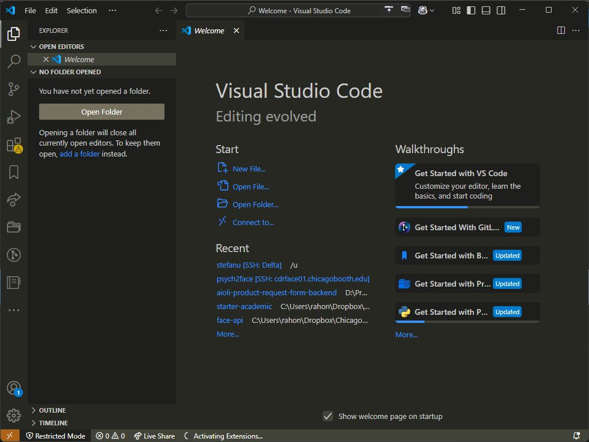
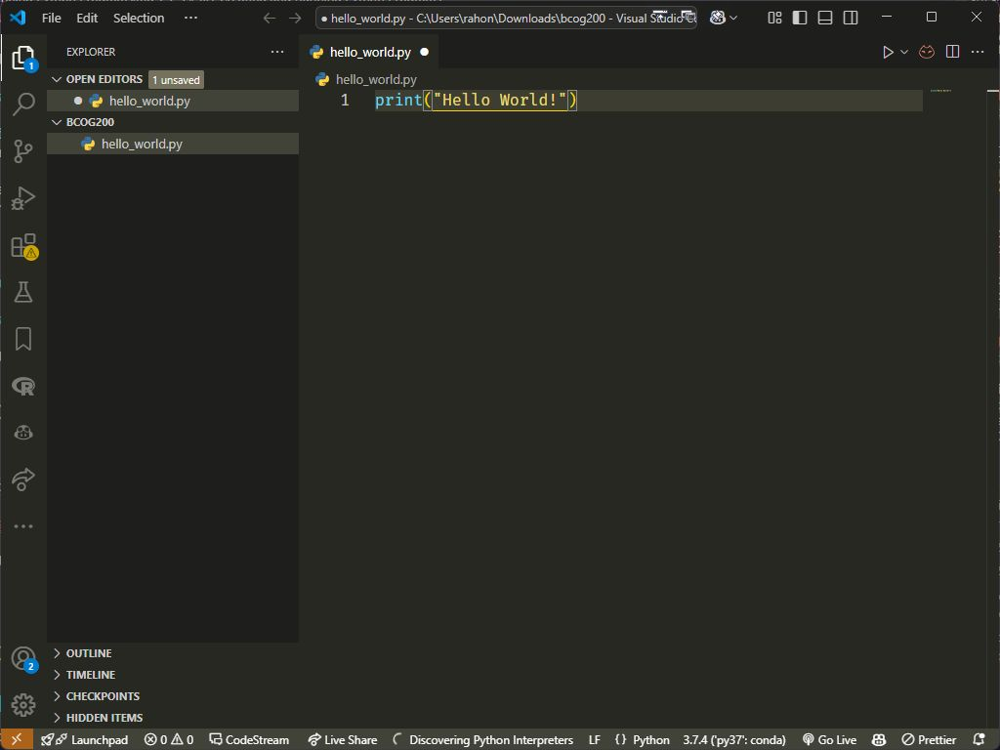
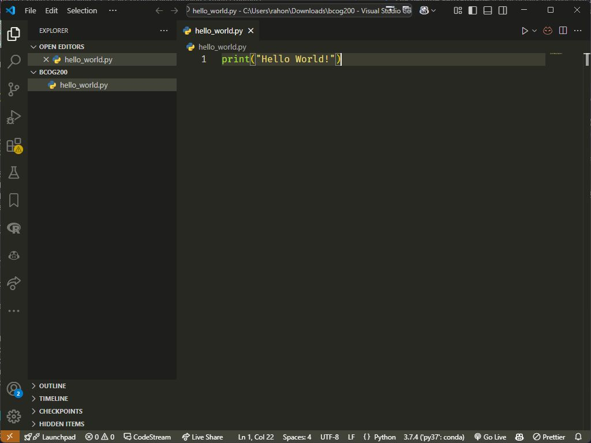

# 0.1 Creating and Running Python Programs

Once you have installed Python, you can use it to run Python scripts.
Python scripts are files that end in `.py`. Let's make our first Python program and try to run it
to test to see that we have installed Python correctly.

To create and run a Python script, there are two additional pieces of software we have to use:

1. A text editor where we will write the code
2. A "Terminal" application where we will execute the code.

For text editors, you cannot use Microsoft Word or Google Docs, or even most of the more basic text editors that come
installed on computers today. This is because they include lines that are invisible to you but used by the text editor
to keep track of formatting, font information, and all sorts of other stuff. So we are going to need to download a
program that doesn't have that problem. In addition to this issue, many text editors are made specifically for writing
computer programs that have all sorts of features built into them, like syntax highlighting (i.e., turning text
different colors depending on whether it is a keyword in the programming language) and even automatically detecting and
warning you about potential errors. In the next section
([0.4. Text Editing Software](0.4.%20Text%20Editing%20Software.md)) we will describe a few different options for text editors and their pros
and cons, so you can pick the one you want to use. But for now, we want to get a basic one to get started.

A basic (and free) text editor is always a great program to have, even if you decide to use one with more features
later. So for this, we are going to start with Visual Studio Code (VS Code). You can download VS Code from
[https://code.visualstudio.com](https://code.visualstudio.com). Make sure to download and install the correct version
for your operating system. VS Code is free and open-source, developed by Microsoft but with contributions from the
developer community.

Once you have VS Code installed, open it (by double-clicking on it in your Applications directory or by searching for it
in your computer's search function). The first time you open it, you will get a welcome screen that looks something like
this:



If you haven't already, create a folder where you are going to store your work for this class. I created a folder on my
Desktop called "bcog200" (lowercase, no spaces).

We will talk more about conventions for naming things later, but for now, it is important to know a couple of things.

- For almost everything we will do in Python, everything is case-sensitive (upper vs. lower case), and characters like
  spaces and underscores matter and mean different things. So keep track of which ones you use!
- You will be typing some of these things (like directory locations) many times, so you want to make choices that
  facilitate three things (which sometimes conflict):
  1. Remembering what you name things so you can retype them easily (which means trying to be consistent about things
     like your use of upper case vs. lower case, and use of spaces, underscores, and other ways of segmenting words)
  2. Using names that are concise but meaningful: too short and you might not remember it, too long and it is a pain to type
  3. Making choices that are easy to type (e.g., avoiding capitalization and other characters that require the shift key
     wherever possible).

Now, in your VS Code window, click on the "Explorer" tab on the left (it looks like two paper files stacked on top of
each other). Then, click on the "Open Folder" button and navigate to the bcog200 folder you just created on your
computer. If you put it in the same spot as me, it would be in your Desktop. So on my computer, it would be
`/Users/stefanu/Desktop/bcog200`. On my Windows machine, it would be `C:\Users\stefanu\Desktop\bcog200`.

Next, create a new file. You can do this by clicking "File" > "New File" or by clicking the "New File" button towards
the top of the Explorer tab, in the sidebar of the VS Code window. Give your file the name `hello_world.py`. Make sure
you use all lowercase, put an underscore between the words, and make sure not to forget the `.py` ending. This is how
your computer will know it is a Python script.

> [!NOTE]
>
> **File naming conventions**: It is generally the case that your file and folder names should avoid spaces and special
> characters. In most cases, you should only use lowercase letters, underscores, and numbers when appropriate.

Into the file, type the following line:

```Python
print("Hello World!")
```

Now you can save the file — you can do this with a keyboard shortcut: <kbd>CTRL</kbd> + <kbd>S</kbd> on Windows or
<kbd>CMD</kbd> + <kbd>S</kbd> on Mac.

A quick note about VS Code (and many other text editors) is that they provide a visual cue about whether you have
made changes to the file without saving it. In VS Code, you'll see a white dot in the tab of any unsaved file:



The dot will go away when the file is saved, and will be replaced by an X (to allow you to close the file). This is what
it looks like when the file is saved properly:



You will often find that when you try to run a program, it doesn't do what you want because you forgot to save the file.
Get in the habit of hitting <kbd>CTRL</kbd> + <kbd>S</kbd> (or <kbd>CMD</kbd> + <kbd>S</kbd> on a Mac) frequently to
save your work.

Now we are ready to try to run the program. To do so, open your Terminal application. On a Mac, this is called
"Terminal" is located in your Utilities directory, which is located in your Applications directory. On Windows, it is
called "Command Prompt." On both Mac and Windows, you can find it easily by using the search command (just make sure you
search for "Terminal" on Mac and "Command Prompt" on Windows). We are going to use this program so often, I would
recommend you put it somewhere easy to access, like adding it to your Dock on your Desktop.

When you have opened the Terminal, you should see a window that looks like this on Mac:


Or like this on Windows:


The terminal program is a text-based way to give commands to your computer. You can do almost all of the same stuff you
could do with a mouse and much more. In [0.3. Terminal Crash Course](0.3.%20Terminal%20Crash%20Course.md) we will have a
quick terminal tutorial, but for now, you just need to know the following.

Most commands are the same for Mac's Terminal and Window's Command Prompt, but when they are different, we will let you
know.

When you are using the Terminal, it always assumes you are located in a particular folder, and you need to "move
yourself" around to access or run files in different folders. When you first open the Terminal, your default location is
in your user's home directory (in my case, `/Users/stefanu/`). You can see this by typing the command `pwd`.


We need to move to where we saved our file, on our Desktop, inside the bcog200 directory. To change directories, you use
the `cd` command, followed by a space and the directory you want to move to. You have to type the location relative to
your current location. The Desktop folder is inside your user's home directory, which you can see by typing `ls` on Mac
and `dir` on Windows to list all the files and folders in the current directory:


If you type `cd Desktop`, that will move you to the Desktop directory. You will see it worked because the prompt will
change from ending with your user directory name to Desktop.


If you now type `ls` (or `dir` on Windows), it will list all the files and folders on your Desktop. One of them should
be the bcog200 folder. If it is, you can now type `cd bcog200` to move into that folder. We also could have typed
`cd Desktop/bcog200` to move into that folder all in one command instead of doing it in two steps. You can move
anywhere on your computer in one `cd` command as long as you know how to specify the location.

Once you are in the bcog200 directory, if you list the directory contents, you should see your python script.


Ok, we are finally ready to run the program. Type `python3.12 hello_world.py` into the Terminal, and if Python is
installed correctly, it should print out the text. If you are using Windows you can also just type
`python hello_world.py`.


Next: [0.2. Code vs. Comments](0.2.%20Code%20vs.%20Comments.md)<br>
Previous: [0.0. Installing Python](0.0.%20Installing%20Python.md)
