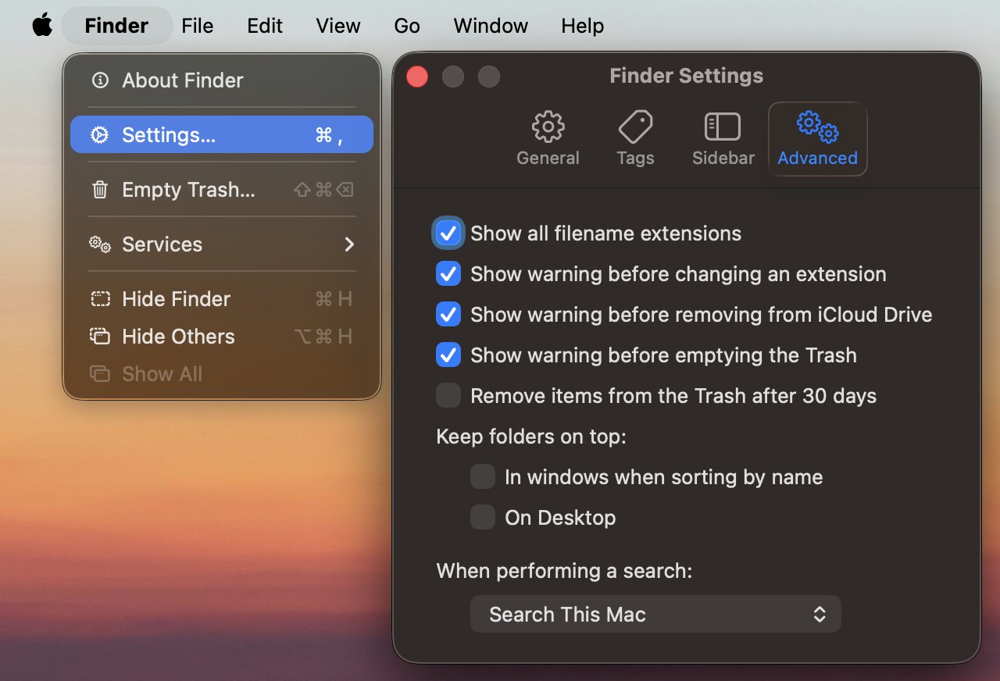
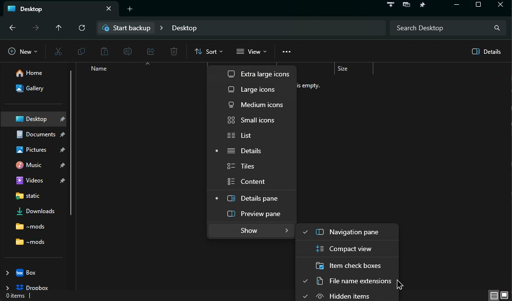

# 8.9. Common Pitfalls in IT

Whereas the previous section was focused on common pitfalls in coding in Python, this section is
focused on common pitfalls involving the broader computing environment around your code: your
terminal, editor, project folder, Python interpreter, file extensions, and so on.

Many student problems that _look_ like Python problems are actually not Python problems at all.
Often, the code is fine, but the computer is looking in the wrong folder, using the wrong Python,
hiding an important file, or running the wrong environment.

Like the section before it, this section is meant to function more like a cheat sheet than a
comprehensive guide. Skim it now, and return to it whenever your setup starts behaving in unexpected
ways.

## Wrong working directory in the terminal

One of the most common mistakes students make is running commands from the wrong folder. Recall from
Chapter 0 that your terminal always has a current working directory. When you run a command, that
command acts relative to whatever folder the terminal is currently in.

This can cause problems like:

- `python` cannot find the file you are trying to run
- `uv add` installs into the wrong project
- `uv run` cannot find your `pyproject.toml`
- file paths that "should work" suddenly raise `FileNotFoundError`

Before doing much else, check where you are by running the following commands in order in your
terminal:

```bash
pwd  # print working directory
ls  # list files and directories
```

If you are not in the correct project folder, change into it with `cd` (change directory):

```bash
cd path/to/your/project  # change directory to the path to your project
# make sure to replace the placeholder with the actual path to your actual project
```

If you are not sure whether you are in the correct folder, look for familiar project files like:

- `pyproject.toml`
- `.python-version`
- `.gitignore`
- your Python scripts
- data folders such as `data/`, `images/`, or `results/`

If you cannot see any of the "hidden" folders like `.venv`, `.git`, or `.gitignore`, you may need to
show them by either configuring your file manager (Finder on Mac, File Explorer on Windows) to show
hidden files, or by running the following command in your terminal:

```bash
ls -la  # list all files and directories, including hidden ones (long format)
```

> [!TIP]
>
> When something "mysteriously" goes missing, your first question should usually be:
> **"What folder is my terminal actually in right now?"**

## Wrong folder open in VS Code

Even if your terminal is in the right place, your editor (e.g., VS Code) itself may be opened in the
wrong folder. This can cause many confusing behaviors. For example, the Explorer sidebar may not
show the files you expected; the integrated terminal may complain about files not being found when
you press the big "Play" button to get your code to run; the Python interpreter selector may show
the wrong environment; and dotfiles like `.python-version` or `.venv` may seem to be missing.

In most cases, you can employ a simple fix: qopen the _project folder itself_, rather than a parent
folder, child folder, or a single file from somewhere else. In VS Code, you can do this by clicking
the "Open Folder" button in the Explorer sidebar and selecting the root folder of your project.

> [!WARNING]
>
> ### Beware the "Play" button!
>
> Despite my warnings about the "Play" button, many students still use it to run their code. This is
> a bad habit to get into, as it can lead to many confusing errors. It obfuscates the complexity of
> running your code in the terminal, and it can lead to many subtle bugs that are hard to debug.
> Instead, run your code directly from the terminal, in the appropriate folder, using
> `uv run python my_script.py` (or `python my_script.py`
> if you have your environment activated correctly).

## Hidden files and folders are invisible by default

Many important project files and folders are hidden to you by default. This is often communicated to
you by means of their names beginning with a dot:

- `.venv`
- `.python-version`
- `.gitignore`
- `.git`
- `.env`

If hidden files are not visible, students often conclude that these files do not exist. But jsut because they are out of sight does not mean they should be out of mind.

Some quick fixes:

- In **Finder on Mac**, press <kbd>Cmd</kbd> + <kbd>Shift</kbd> + <kbd>.</kbd> to toggle hidden
  files/foldes
- In **Windows File Explorer**, select "View" -> "Show", then select "Hidden items"

If you know that you are in the right folder (a la the previous section), but you cannot see your
`.python-version`, `.venv`, or `.gitignore` files, do not assume they are missing. First check
whether your system is simply hiding them from you. And you can always run `ls -la` in your terminal
to list all files and folders, including hidden ones.

## Wrong environment activated

Another very common issue is that students install packages into one environment, but run Python
from a different environment.

This usually produces errors such as:

- `ModuleNotFoundError: No module named 'package_that_should_be_there'`
- the code runs in one terminal window but not another
- VS Code says a package is missing even though you already installed it

This can usually be solved by answering two closely related questions:

1. Which Python is your terminal using?
2. Which Python is VS Code using?

Those are not always the same.

One helpful diagnostic is to ask Python to identify itself:

```bash
python --version
python -c "import sys; print(sys.executable)"
```

If you are using `uv`, it is often even safer to run Python _through `uv`_:

```bash
uv run python --version
uv run python -c "import sys; print(sys.executable)"
```

Your system may, for one reason or another, have more than one Python interpreter installed. Maybe
your system came with Python 3.12 installed by default, but then you also manually installed Python
3.13 directly from the Python website, then later installed uv and are now using that to manage your
project. Taking these steps to interrogate which Python you are using will help keep you sane.

In VS Code, also make sure that the selected Python interpreter points to the environment for the
current project, often something inside `.venv` if you are using `uv` to manage your project.

## Mismatch between `pyproject.toml` and `.python-version`

Your project may specify a Python version in more than one place. Two common ones are:

- `pyproject.toml`
- `.python-version`

If those two disagree, strange things can happen:

- one tool tries to use one version of Python (e.g., 3.12) while another tool uses another version
  (e.g., 3.13)
- VS Code selects one interpreter but `uv` prefers to use another
- your environment may need to be recreated because the version constraints changed

Check whether these files all agree with one another. Make sure that your `.python-version` file says the same version of Python as your `pyproject.toml` file.

If you recently changed the version, you may also need to rebuild or resync the environment so that
your tooling catches up with the new configuration. This is often as simple as running `uv sync`. If
that still doesn't work, delete the `.venv` folder and run `uv venv` again (from the correct folder,
which is the root folder of your project containing your `pyproject.toml` file).

## Incorrect or missing file extensions

Operating systems sometimes hide file extensions, which leads students to accidentally create files
with names like:

- `Python script file` (with no extension at all)
- `notes.md.txt` (with two competing extensions)
- `notes.py` (when they meant `notes.md`)

This creates chaos, as your files will not run or render as expected. Always verify the full filename, including the extension.

For this course, common extensions include:

- `.py` for Python scripts
- `.md` for Markdown files
- `.txt` for plain text
- `.csv` for comma-separated data
- `.json` for JSON files

If your file manager hides extensions, turn them on whenever possible. In Mac's Finder, you can do this by taking the following steps:

- Open a new Finder window
- In the top left corner of the whole screen, click on "Finder" -> "Settings" (or press <kbd>Cmd</kbd> + <kbd>,</kbd>)
- Select the "Advanced" tab in the window that pops up
- Click the box labeled "Show all filename extensions" and make sure it is checked



In Windows File Explorer, you can do this by taking the following steps:

- Open a new File Explorer window
- In the ribbon towards the top of the window, click on "View"
- Hover your mouse over "Show"
- Make sure the "File name extensions" option is checked
- While you're there, make sure the "Hidden items" option is also checked (a la the previous section)



## Running the wrong file entirely

Sometimes the problem is not your code, but the fact that you are not actually running the file you
think you are running.

This happens more often than you might expect when:

- you have multiple copies of the same script in different folders
- you renamed a file but are still running the old filename
- you are editing one file in VS Code and running another from the terminal

If behavior does not match the code in front of you, verify:

- the exact filename you are running
- the exact folder that file lives in
- whether there are duplicate copies that might exist elsewhere

To that end, it might help to have a proper file search program on your system. On Windows, you can
use ["Search Everything" by voidtools](https://www.voidtools.com/downloads/), which is far superior
to the built-in search options available in Windows. On Mac, you can use the built-in "Spotlight"
search or an alternative like [Raycast](https://www.raycast.com/).

## Multiple environments or stale `.venv` folders

Students sometimes end up with several environments nested across multiple folders. This results in the wrong one getting activated, or VS Code picking the wrong one automatically.

This can lead to frustrating, confusing, potentially irreproducible errors like:

- imports that worked yesterday but not today
- the editor shows red squiggly underlines for packages that you know you just installed
- you press the "Play" button in your editor and it gives you a `ModuleNotFoundError`

As a general rule, _each project should have a single, clear environment associated with it_. If you
have old or stray `.venv` folders in parent directories, they can confuse both you and your editor.

Follow these steps to diagnose the issue:

1. Make sure you are in the correct project folder.
2. Check which interpreter is being used. Your VS Code tells you which environment is active in the
   bottom right corner of the window. Click on it to make sure it is the one you believe should be
   used.
3. Check whether there are extra `.venv` folders above, below, or beside the project folder.
4. Resync or recreate the environment if necessary. (See above for examples of syncing or recreating
   the environment.)

## File paths that depend on where you run the program

Students often assume that relative paths are based on the location of the script file. However, in
most cases, they are actually based on the _current working directory_ from which the script was
run.

That means a path like:

```python
open("data/input.csv")
```

may work in one terminal session and fail in another if you were to run the script from different
folders.

If you see a `FileNotFoundError` when trying to open a file, ask yourself:

- What folder am I in? That is, what is the current working directory of my terminal? (This includes
  when I press the "Play" button in VS Code, which runs the script from the currently open project
  folder, whatever that is for you at the time.)
- What path is Python looking for relative to that folder?
- Does the file I'm looking for really exist there?

Being in the correct folder makes the difference between your code running successfully or not.

If you really want to make your scripts foolproof, you can use the `pathlib` library to handle
running the script from the correct folder, regardless of where you are in the file system.

```python
from pathlib import Path

parent_dir = Path(__file__).parent # gets the parent directory of the current script
# then you can use the parent directory to construct the paths to the other files you want to use
# for example:
data_file = parent_dir / "data" / "input.txt"
with open(data_file, "r") as f:
    data = f.read()
```

## A quick troubleshooting checklist

Before asking for help, check the following:

1. Am I in the correct folder in the terminal?
2. Is VS Code opened to the correct project folder?
3. Can I see hidden files like `.venv`, `.python-version`, and `.gitignore`?
4. Which Python interpreter is my terminal using?
5. Which Python interpreter is VS Code using?
6. Is my environment activated, or am I using `uv run` consistently?
7. Do `pyproject.toml` and `.python-version` agree about the Python version?
8. Do I have all the packages I need installed to the correct environment?
9. Is my file name formatted correctly (no spaces)?
10. Does my file actually end in the correct file extension (e.g., `.py` for Python files)?
11. Am I definitely running the file I think I am running?
12. Are there duplicate files or extra virtual environments confusing things?

If you can answer those questions clearly, you will be able to solve many problems on your own!

## Conclusion

Many "technical" problems are really problems of what I like to call "code bureaucracy": being in
the wrong folder, using the wrong interpreter, using the wrong environment, etc. This is normal. It
does not mean that you are bad at programming. It means that modern development environments have
many moving parts, and learning to coordinate them is part of becoming a competent programmer.

The good news is that these issues become much easier once you develop the habit of checking your
working directory, your interpreter, your environment, and your filenames before diving into more
complicated solutions.

<!-- GITHUB-NAV-START -->

Previous: [8.8. Common Pitfalls](8.8.%20Common%20Pitfalls.md)<br>

<!-- GITHUB-NAV-END -->
