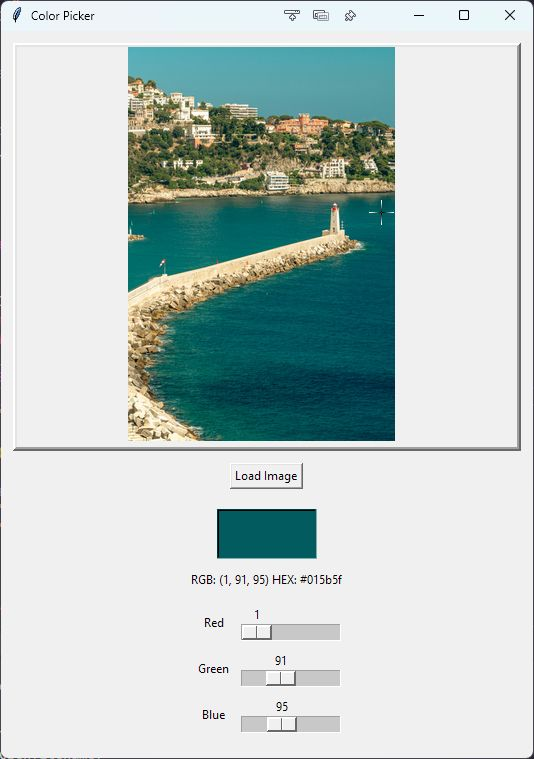

# 11.5. An Example GUI

To tie all this together, let's create a simple application that allows us to upload an image, display it, and then pick
a color from a pixel in the image. We'll also add some sliders to adjust the RGB values of the chosen color. In addition to `tkinter`, We'll use the `PIL` library to handle the image.

```python
import tkinter as tk
from tkinter import filedialog
from PIL import Image, ImageTk # need ImageTk since tkinter can't handle standard PIL images directly

# Constants
CANVAS_WIDTH = 500
CANVAS_HEIGHT = 400
COLOR_DISPLAY_WIDTH = 100
COLOR_DISPLAY_HEIGHT = 50

BLACK = (0, 0, 0)

class ColorPicker:
    def __init__(self, root):
        self.root = root  # tkinter root window
        self.root.title("Color Picker")  # window title

        # Instance variables
        self.image = None  # PIL Image
        self.photo = None  # tkinter PhotoImage
        self.selected_color: tuple[int, int, int] = (
            BLACK  # Initialize to sensible default color
        )

        # Image properties -- we'll change these when the image is loaded
        self.image_x = 0
        self.image_y = 0
        self.image_width = 0
        self.image_height = 0

        # Image boundaries
        self.image_left = 0
        self.image_right = 0
        self.image_top = 0
        self.image_bottom = 0

        # Create GUI elements
        self.setup_gui()

        # Initialize the color display
        self.update_color_display()

    def setup_gui(self):
        # Main frame
        self.main_frame = tk.Frame(self.root)
        self.main_frame.pack(padx=10, pady=10)

        # Image display
        self.canvas = tk.Canvas(
            self.main_frame,
            width=CANVAS_WIDTH,
            height=CANVAS_HEIGHT,
            relief=tk.RAISED,  # raised relief -- gives the impression of depth
            bd=4,  # border width
            cursor="arrow",  # Default cursor
        )
        self.canvas.pack()

        # Add canvas bindings
        self.canvas.bind("<Button-1>", self.pick_color)
        self.canvas.bind("<Motion>", self.update_cursor)  # Add motion binding

        # Buttons frame
        self.button_frame = tk.Frame(self.main_frame)
        self.button_frame.pack(pady=10)

        # Load image button
        self.load_btn = tk.Button(
            self.button_frame, text="Load Image", command=self.load_image
        )
        self.load_btn.pack(padx=5)

        # Color display frame
        self.color_frame = tk.Frame(
            self.main_frame,
            width=COLOR_DISPLAY_WIDTH,
            height=COLOR_DISPLAY_HEIGHT,
            relief=tk.SUNKEN,  # sunken relief -- gives the impression of depth
            bd=2,  # border width
        )
        self.color_frame.pack(pady=10)

        # Color info label
        self.color_info = tk.Label(self.main_frame, text="RGB: --- HEX: ---")
        self.color_info.pack()

        # Add RGB sliders frame
        self.slider_frame = tk.Frame(self.main_frame)
        self.slider_frame.pack(pady=10)

        # Create RGB sliders
        self.sliders = {}

        # We could write these out one at a time, but a for loop saves us some time!
        for color_letter, color_text in [("r", "Red"), ("g", "Green"), ("b", "Blue")]:
            frame = tk.Frame(self.slider_frame)
            frame.pack(fill="x", padx=5, pady=2)

            label = tk.Label(frame, text=color_text, width=6)
            label.pack(side=tk.LEFT)

            # So I learnt that the slider callback (in command) automatically passes its current value
            # So we need to deal with that in the callback
            # We have two strategies to deal with that: lambda vs. eating the parameter
            slider = tk.Scale(
                frame,
                from_=0,
                to=255,
                orient=tk.HORIZONTAL,
                command=self.update_from_sliders,  # Here we're eating the parameter -- within update_from_sliders we'll use _=None
                # command=lambda v: self.update_from_sliders(), # if we did it this way, we wouldn't need the _=None in update_from_sliders, but this looks more complicated to my eye
            )

            slider.pack(side=tk.LEFT, fill="x", expand=True)
            self.sliders[color_letter] = slider

    def load_image(self):
        file_path = filedialog.askopenfilename(
            filetypes=[("Image files", "*.png *.jpg *.jpeg *.bmp")]
        )
        if file_path:
            # Load the image
            self.image = Image.open(file_path)

            # Resize the image to fit the canvas while maintaining its aspect ratio
            display_size = (CANVAS_WIDTH, CANVAS_HEIGHT)

            # Make a thumbnail of the image using the display size
            # LANCZOS is one of the resampling methods used to downscale images nicely
            self.image.thumbnail(display_size, Image.Resampling.LANCZOS)

            # Create a tkinter PhotoImage object from the PIL Image
            self.photo = ImageTk.PhotoImage(self.image)

            # Calculate the image's position on the canvas
            self.image_x = CANVAS_WIDTH // 2  # note the use of integer division via two slashes
            self.image_y = CANVAS_HEIGHT // 2
            self.image_width = self.photo.width()
            self.image_height = self.photo.height()

            # Store image boundaries
            self.image_left = self.image_x - self.image_width // 2
            self.image_right = self.image_x + self.image_width // 2
            self.image_top = self.image_y - self.image_height // 2
            self.image_bottom = self.image_y + self.image_height // 2

            # Draw the image on the canvas
            self.canvas.create_image(self.image_x, self.image_y, image=self.photo)

    def update_cursor(self, event):
        if self.image:
            x = self.canvas.canvasx(event.x)
            y = self.canvas.canvasy(event.y)

            # Make the cursor a crosshair if it's within the image's boundaries
            if (
                self.image_left <= x <= self.image_right
                and self.image_top <= y <= self.image_bottom
            ):
                self.canvas.config(cursor="crosshair")
            else:
                self.canvas.config(cursor="arrow")

    def pick_color(self, event=None):
        if self.image and event is not None:
            x = self.canvas.canvasx(event.x)
            y = self.canvas.canvasy(event.y)

            # Check if click is within image bounds
            if (
                self.image_left <= x <= self.image_right
                and self.image_top <= y <= self.image_bottom
            ):
                # Now things get a little hairy because we are deadline with three different coordinate systems!
                # 1. Canvas coordinates (where the user clicked)
                # 2. Image coordinates (where the image is on the canvas)
                # 3. Actual image pixel coordinates (where we need to get the color from)
                # We start with 1 and need to get to 3.

                # Convert canvas coordinates to relative image coordinates
                rel_x = x - self.image_left
                rel_y = y - self.image_top

                # Convert relative image coordinates to actual image pixel coordinates
                img_x = int((rel_x * self.image.width) / self.image_width)
                img_y = int((rel_y * self.image.height) / self.image_height)

                # Get the color of the pixel at the clicked location
                self.selected_color = self.image.getpixel((img_x, img_y))

                self.update_color_display()

    def update_from_sliders(self, _=None):
        # It needs to be _=None because the slider callback automatically passes its current value
        # We don't need it, so we set it to _
        r = self.sliders["r"].get()
        g = self.sliders["g"].get()
        b = self.sliders["b"].get()
        self.selected_color = (r, g, b)
        self.update_color_display()

    def update_color_display(self):
        # We'll unpack the tuple into r, g, b to make my life a little easier
        r, g, b = self.selected_color

        # and use f-strings to format it into hexadecimal format
        # 02x means 2 digits, hex, no padding
        hex_color = f"#{r:02x}{g:02x}{b:02x}"

        self.color_frame.configure(bg=hex_color)

        # Update the color info text
        rgb_text = f"RGB: {self.selected_color}"
        hex_text = f"HEX: {hex_color}"
        self.color_info.configure(text=f"{rgb_text} {hex_text}")

        # Update sliders without triggering their callbacks
        self.sliders["r"].set(r)
        self.sliders["g"].set(g)
        self.sliders["b"].set(b)


def main():
    root = tk.Tk()
    app = ColorPicker(root=root)
    app.root.mainloop()
    # could also just do root.mainloop() here, but since we went
    # to the trouble of creating a class, let's use it!


if __name__ == "__main__":
    main()
```

If you copy-paste this into a new python file and run it, you'll see a window with a button to load an image, a canvas to
display the image, a square patch to display the color, and three sliders to adjust the color.



The lab involves doing similar things to the code above, so this should give you an idea of how to make sliders, show images, and place buttons.

Next: [11.6. Lab 11](11.6.%20Lab%2011.md)<br>
Previous: [11.4. Tkinter Canvases](11.4.%20Tkinter%20Canvases.md)
