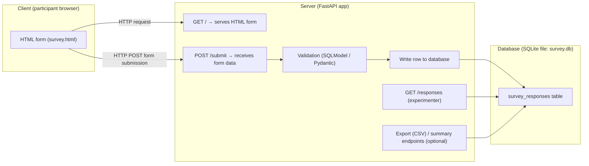

# 20.0. Web Programming

More and more experiments in cognitive science are being run online, using platforms such as
Prolific or Connect to perform large-scale data collection. (Alas, Amazon Mechanical Turk has fallen
out of favor due to the proliferation of bots and low-quality participants on the platform.)

Indeed, much of my own lab's work is conducted using the web, which requires a completely different
set of tools and skills than the ones used in traditional lab experiments. The goal of this chapter
is to equip you with the basics of online experimentation by building a tiny web-based experiment.
We will build a minimal demo of a survey that runs in your browser, sends responses to a
local Python server, and saves those responses in a database locally on your own computer.

When building a traditional lab experiment, everything to do with the experiment can be run on the
same computer: the experiment's logic, presentation, and data collection are all performed on the
same machine. Indeed, everything we have done in the class so far has made use of this same
approach, including the experiment we built in Chapter 13. Unfortunately, this approach of
one-computer-does-it-all becomes impossible when dealing with online experiments. Instead, web
experiment programming typically relies on a **client-server architecture**. In this type of
architecture, the components for the web experiment are split into three main parts:

- The **client** (in this case, running in the participant's web browser) takes care of all the
  participant-facing parts of the experiment. In our case, this means showing survey questions and
  collecting responses. This is also called the "frontend" of the experiment.
- The **server** (in this case, a Python server running locally on your computer, though later you
  could make it accessible online by deploying it to a cloud service) takes care of any logic to do
  with setting up the experiment, as well as data collection. This includes receiving requests from
  the client, validating the data, storing it, and then providing some way for you (the
  experimenter) to access the data. This is also called the "backend" of the experiment.
- Lastly, the **database** (in this case, a SQLite file stored on your computer) stores the data
  collected from the participants. There are other kinds of databases available, such as PostgreSQL
  or MySQL, but SQLite makes the most sense for a small, local demo like this one. We'll cover how
  to use the database in [Chapter 20.5](20.5.%20Setting%20Up%20the%20Database.md).

Below is a diagram showing how data flows through the experiment, from the client to the server and
eventually to the database.

In practice, this means that writing web experiments involves creating a **full-stack web
application**, with both a frontend and a backend (which encompasses the database logic as well).
The frontend is usually built with the languages natively understood by web browsers, such as HTML
and CSS, and (perhaps most importantly) JavaScript, which is the primary programming language that a
traditional web browser can execute directly (so most frontend logic is written in JavaScript). This
is often supplemented with the use of various libraries and frameworks (such as React, Vue, or
Svelte) to make the frontend more user-friendly and interactive, as well as developer-friendly.

However, because this is a Python course, we are going to keep the frontend extremely simple: we
will build our survey using plain HTML forms and avoid any custom CSS or JavaScript.

The backend can be built with any number of languages typically used for server-side programming,
such as Python, Node.js, PHP, C#, Ruby, Go, and many others, and each of these languages also has
its own set of libraries and frameworks to scaffold development.

Naturally, in line with the rest of the book, this chapter will focus on building the backend using
Python. We'll use two modern Python libraries to accomplish this:

- **FastAPI**: a lightweight framework for building Application Programming Interfaces (APIs).
  (Think of an API as a set of rules dictating how the client and server can communicate with each
  other.) [Documentation available here](https://fastapi.tiangolo.com/)
- **SQLModel**: a library built on top of SQLAlchemy and Pydantic for defining database tables and
  validating data. (Yes, we will need to learn how to use databases in order to store our data!)
  [Documentation available here](https://sqlmodel.tiangolo.com/)

> [!NOTE]
>
> ### The docs are your friend
>
> When in doubt, always refer to the documentation for the library you are using. Sometimes the docs
> can be intimidating, but they really are comprehensive, helping you understand how to use the
> library and its features. In these two cases, the docs are especially helpful, serving as literal
> tutorials for the libraries in question.

The survey we will build will be intentionally barebones. We'll use a couple of Likert-scale items
adapted from the Ten Item Personality Inventory (TIPI), plus an optional open-ended "comments"
question.

As a rule of thumb, we try to avoid collecting personally identifying information (PII) by default.
This means we avoid asking about names, emails, social security numbers, or anything else that could
be used to identify the participant. (Of course, standard demographic questions like age or
education level are not considered PII, and are commonly asked in surveys.)

## What you'll learn in this chapter

By the end, you should be able to:

- Run a FastAPI server locally
- Understand what a route/endpoint is and how to define one in FastAPI
- Use your server's interactive docs to debug your own routes/endpoints
- Define database tables and validation schemas with SQLModel
- Write API routes/endpoints that read from and write to the database
- Build a tiny frontend page using plain HTML forms that can send data to your FastAPI server
- (Optional) deploy a minimal version of your app to a cloud hosting service like [Railway](https://railway.com/)

Next: [20.1. Setup with uv](20.1%20Setup%20with%20uv.md) 
Previous: [18.6. Homework 18](../CH18/18.6.%20Homework%2018.md)
